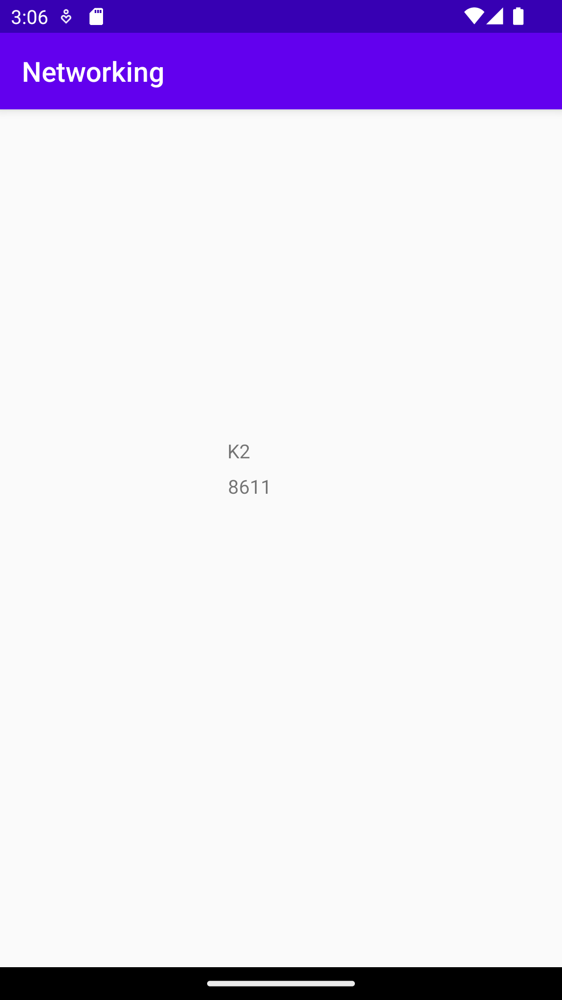

# Rapport

Jag implementerade en recyclerview i layout filen activity_main. Sedan la jag till en array list som fick namnet "MountainList".
Jag skapade en ny xml fil för layouten av recyclerview som fick namnet recyclerview_item.xml.
Variabeln "Adapter" för RecyclerViewAdapter och variabeln "RecyclerView" för RecyclerViewn skapades i MainActivity.
Efter det la jag till en ny class för RecyclerViewAdaptern och skapade själva Adaptern där. La också till de andra klasserna som behövdes,
dessa var Moutain och ViewHolder.
Sedan hämtade jag informationen för bergen med koden och från den givna länken som man kan se nedan.
"private final String JSON_URL = "https://mobprog.webug.se/json-api?login=brom";"

För att föra över datan från webbtjänsten, så används denna kod nedan.
@Override
public void onPostExecute(String json) {
Gson gson = new Gson();
Type type = new TypeToken<ArrayList<Mountain>>() {
}.getType();
ArrayList<Mountain> data = gson.fromJson(json, type);
MountainList.addAll(data);
Adapter.notifyDataSetChanged();
}

Nedan kan man se en screenshot på hur informationen ser ut när den skrivs ut i RecyclerViewn

